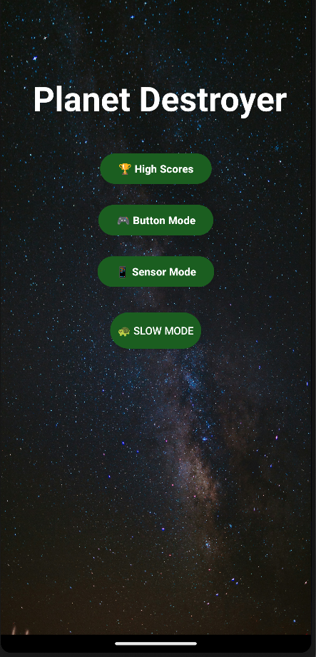
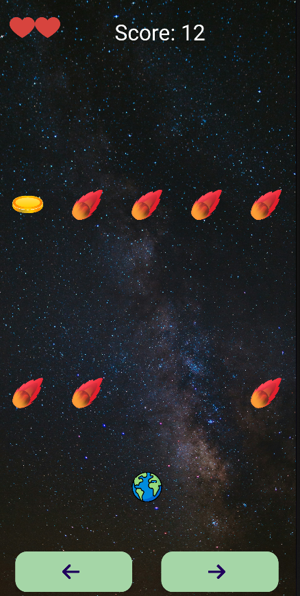
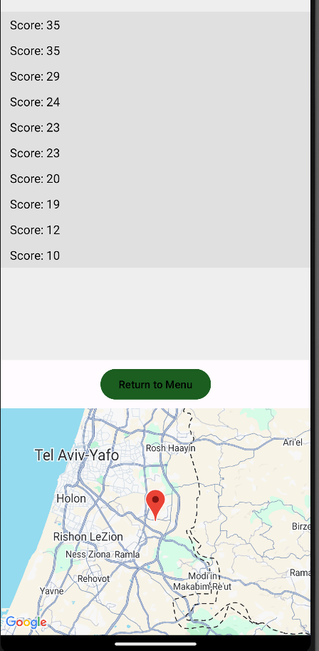

# 🚀 Planet Destroyer (Android Game)

A fast-paced, Kotlin-based endless runner where you control a spaceship dodging meteors, collecting coins, and trying to survive as long as possible. Built for Android devices with both touch and tilt (sensor) control support.

---

## 🎮 Game Features

- 🌌 5-lane gameplay with random meteor spawns
- 🕹️ Touch and tilt (accelerometer) controls
- 💥 Explosion sound & vibration on collisions
- 🪙 Coin spawning logic with sound feedback
- ❤️ Lives system with heart indicators
- 📏 Distance-based scoring system
- 🗺️ High score saving with timestamp and location
- 🌍 View top scores on Google Maps
- 🎵 Background music support
- 📱 Designed for both emulator and real devices

---

## 📸 Screenshots

```markdown



```

---

## 🧰 Tech Stack

- Kotlin
- Android SDK
- Google Maps SDK
- Fused Location Provider
- Glide (for images/GIFs)
- SharedPreferences (for local score storage)

---

## 📦 Project Structure

```
PlanetDestroyer/
├── activities/
├── logic/
├── manager/
├── utils/
├── res/
│   ├── layout/
│   ├── drawable/
│   └── values/
```

---

## 🚀 Run the Game

1. Clone this repo:
```bash
git clone https://github.com/DanKric/PlanetDestroyer.git
```

2. Open in Android Studio
3. Run on a physical device or emulator

---

## 🌍 Setup Google Maps API

1. Go to [Google Cloud Console](https://console.cloud.google.com/)
2. Enable **Maps SDK** and **Fused Location Provider**
3. Generate an API key
4. Add it in `AndroidManifest.xml`:
```xml
<meta-data
    android:name="com.google.android.geo.API_KEY"
    android:value="YOUR_API_KEY_HERE" />
```

---

## 🙋‍♂️ Author

**Dan Krikli**  
🎓 Afeka College of Engineering  
[GitHub Profile](https://github.com/DanKric)

---

## 📝 Notes

- This is a university project made as part of the mobile development course
- Future additions may include powerups, multiplayer, and leaderboard syncing
